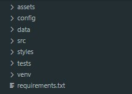

# 🚀 Desenvolvi um dashboard utilizando Python, Streamlit e Plotly, com uma interface simples e interativa que facilita o acompanhamento dos principais indicadores financeiros.

Para garantir uma estrutura organizada e fácil, venho sempre tentando organizar o máximo possível, separando o código por pastas:

As funções de ETL (extração, transformação e carregamento dos dados) estão na pasta src/etl

As funções responsáveis pela criação dos gráficos ficam na pasta src/visualization

Também criei uma pasta styles, onde deixei o arquivo main.css para melhorar o visual do dashboard

No arquivo principal app.py, que está dentro da pasta dashboard, além de integrar todas essas funções, utilizei um pouco de HTML para criar os cartões personalizados, já que o componente metric do Streamlit tem limitações para personalização via CSS.

# Estrutura do projeto:

kotlin
Copy
Edit
dashboard/
│
├── app.py
├── styles/
│   └── main.css
│
└── src/
    ├── etl/
    │   ├── (funções de extração, transformação e carregamento)
    │   └── ...
    │
    └── visualization/
        ├── (funções de plotagem e gráficos)
        └── ...
O projeto foi desenvolvido para uma empresa fictícia que atua na produção e comercialização de componentes e peças industriais, com foco em atender empresas de montagem, manutenção e fabricação de máquinas e estruturas metálicas.

A análise financeira contempla indicadores essenciais para a gestão do negócio, como:

Receita: total obtido com as vendas

Custos: relacionados diretamente à produção

Despesas: como RH, marketing e demais áreas fora da produção

Lucro Bruto: receita menos os custos de produção

Lucro Operacional: resultado após subtrair também as despesas

Margem Bruta e Margem Operacional: porcentagens que mostram a eficiência e rentabilidade do negócio

